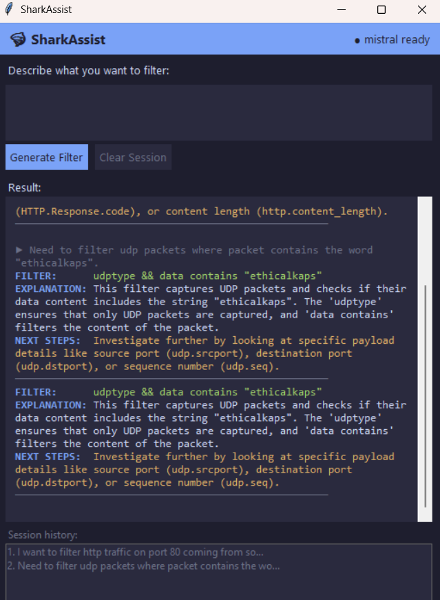

# 🦈 SharkAssist

A floating Python desktop app that sits alongside Wireshark and converts plain English into Wireshark display filters using a local [Ollama](https://ollama.com) model.

## Demo



## Features

- **Plain English → Wireshark filter** powered by `mistral` running locally
- **Explanation** of what each filter captures
- **Next steps** suggestions for deeper investigation
- **Session history** — click any previous filter to re-display it
- **Floating window** — always on top, stays visible next to Wireshark
- No internet required — fully local inference via Ollama

## Requirements

- Python 3.11+
- Ollama (see setup guide below)

## 1. Install Ollama

Ollama runs AI models locally on your machine. SharkAssist requires it to be running before you launch the app.

**Windows / macOS:**
1. Go to [https://ollama.com/download](https://ollama.com/download)
2. Download and run the installer for your OS
3. Once installed, Ollama runs automatically in the background

**Linux:**
```bash
curl -fsSL https://ollama.com/install.sh | sh
```

**Pull the mistral model** (required — do this once after installing Ollama):
```bash
ollama pull mistral
```

> This downloads the mistral model (~4 GB). Make sure Ollama is running before launching SharkAssist. You can verify it's running by opening [http://localhost:11434](http://localhost:11434) in your browser — you should see `Ollama is running`.

## 2. Install SharkAssist

```bash
git clone https://github.com/ethicalkaps/sharkassist.git
cd sharkassist
python -m venv venv
venv\Scripts\activate      # Windows
# source venv/bin/activate  # macOS / Linux
pip install requests
```

## Usage

```bash
python main.py
```

Type a plain-English description of the traffic you want to filter, then press **Enter**.

**Examples:**
- `show me all HTTP traffic to port 80`
- `filter DNS queries from 192.168.1.5`
- `display only TCP SYN packets`

## Project Structure

```
sharkassist/
├── main.py            # Entry point
├── gui.py             # Tkinter UI (dark theme, always-on-top)
├── ollama_client.py   # Ollama REST API wrapper
├── prompt_builder.py  # System prompt + response parser
└── session.py         # In-session filter history
```

## License

MIT
